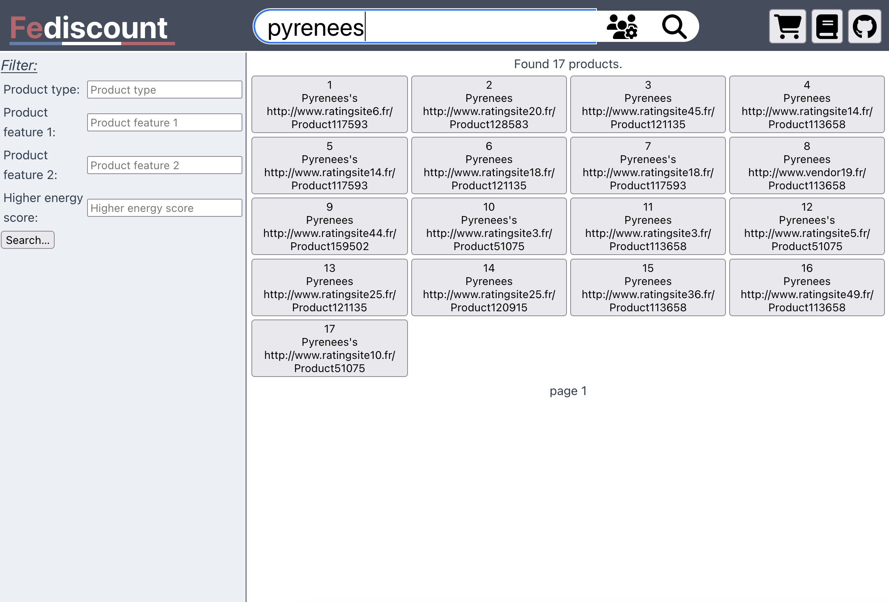

# fediscount-website

Fediscount is a proof of concept for Web applications relying on
configurable federations of SPARQL endpoints. It is an e-commerce
Website where end users can browse a set of products and offers made
available by a set of independent vendors.

<p align="center">
  
  &nbsp; &nbsp; &nbsp; &nbsp;
  
</p>


Fediscount comprises 3 components: (__i__) a Web view accessible through modern
Web browsers, (__ii__) a federation engine able to process queries for
large scale federations in reasonable time, and (__iii__) a federation
of SPARQL endpoints.

## A Web View

This repository hosts the view written using [Vue.js
3](https://vuejs.org/). In this spirit, every view is a component; and
when needed, it communicates its specific queries to the _Log_ that
calls the federations engine and dispatches the results upon receipt.

For a quick deployment, please make sure that
[node.js](https://nodejs.org/) is installed, and follow the
instructions:

```sh
git clone https://github.com/GDD-Nantes/fediscount-website.git
cd fediscount-website
npm install -D

# Run a vite server listening on 5173 by default
npm run dev
```

## A Federation Engine 

Not all federation engines are fit to answer large scale federation of
endpoints [1]. To ensure reasonable response times, we use
[FedUP](https://github.com/GDD-Nantes/fedup) [2], a federation engine
that, compared to the state-of-the-art, builds better logical plans,
among others favoring the identification of exclusive groups.

To deploy FedUP for Fediscount, one must first create 3 tiny quotient
summaries of the targeted FedShop federations (20 endpoints, 100
endpoints, and 200 endpoints) using Apache Jena.

Once created, please run the HTTP server by executing the command as
follows:
```
git clone https://github.com/GDD-Nantes/fedup
cd fedup

# Run the federation engine server on port 3330 by default
# Replace each summary path by yours
mvn exec:java -Dexec.args="--summaries=./fedshop100-h0,./fedshop20-h0,./fedshop200-h0 --engine=FedX --export"
```


## A SPARQL Federation

Large scale federations are infamously tricky to deploy. To alleviate
this issue, we emulate a federation of 200 endpoints using a single
Virtuoso endpoint hosting multiple graphs. We used `Version 07.20.3233-pthreads for Mac OS 11 (Apple Silicon) as of Jun 22 2021`,
and ingested [FedShop](https://github.com/GDD-Nantes/FedShop)'s federation 
of 200 endpoints with a [`.ini` config file](fedshop_200.ini) exposing the API on
port `5555`.


## References

[1] Minh-Hoang Dang, Julien Aimonier-Davat, Pascal Molli, Hala
Skaf-Molli, and Yotlan Le Crom. _FedShop: A Benchmark for Testing the
Scalability of SPARQL Federation Engines._ In The 22th International Semantic
Web Conference (ISWC), Athens, Greece, November, 2023.

[2] Julien Aimonier-Davat, Minh-Hoang Dang, Pascal Molli, Brice
Nédelec, and Hala Skaf-Molli. _FedUP: Querying Large-Scale Federations
of SPARQL Endpoints._ In The Web Conference 2024
(WWW’2024). Singapore, 2024.
